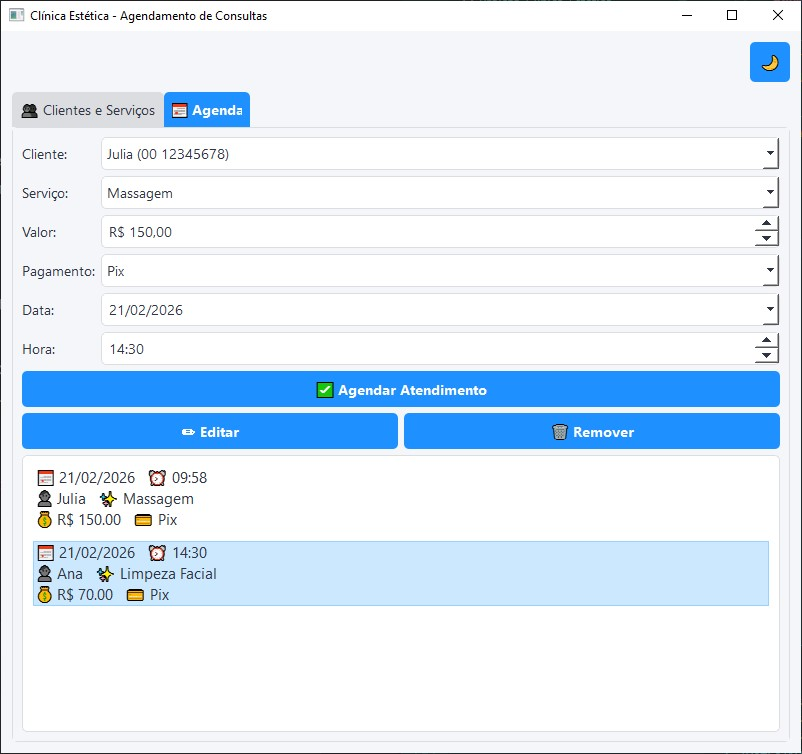
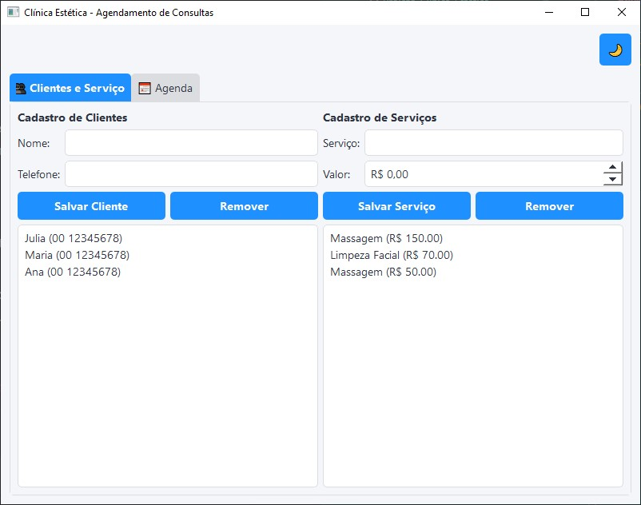
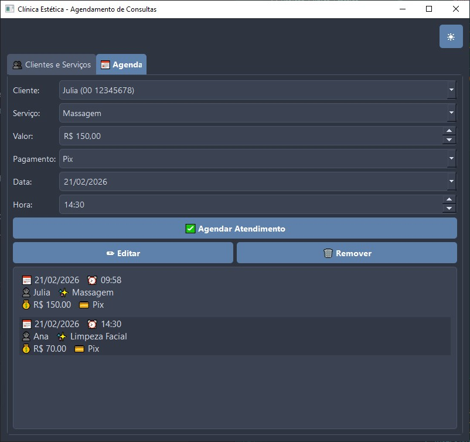
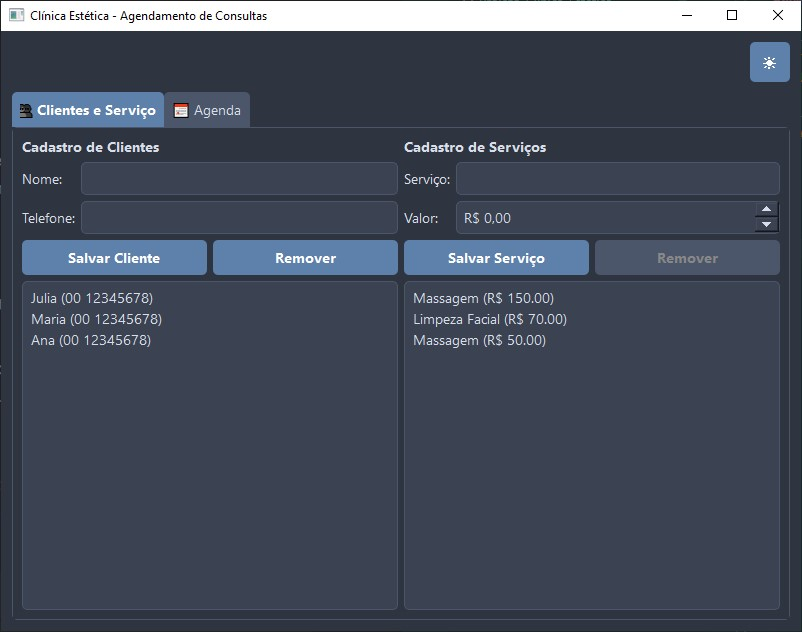

# 📅 Sistema de Agendamento para Clínica Estética

Um aplicativo desktop intuitivo e moderno desenvolvido em Python para gerenciar clientes, serviços e agendamentos de uma clínica estética. Este projeto foi criado com foco na facilidade de uso e em uma interface limpa.

## ✨ Funcionalidades

* **Gerenciamento de Clientes:** Cadastro e remoção de clientes (com proteção contra remoção de clientes com agendamentos ativos).
* **Gerenciamento de Serviços:** Criação de serviços com valores pré-definidos para agilizar o atendimento.
* **Agenda Inteligente:** * Agendamento de consultas com preenchimento automático de valores.
    * Prevenção de conflitos (não permite marcar dois clientes para o mesmo dia e horário).
    * Lista de agendamentos organizada automaticamente por data e hora.
* **Personalização:** Alternância em tempo real entre Tema Claro ☀️ e Tema Escuro 🌙.
* **Persistência de Dados:** Salvamento automático de todas as informações localmente em um arquivo `.json`.

## 💻 Tecnologias Utilizadas

* **Python 3** - Lógica principal e estruturação orientada a objetos.
* **PyQt5** - Construção da Interface Gráfica de Usuário (GUI).
* **JSON** - Armazenamento e leitura de dados de forma leve e rápida.

## 📸 Demonstração Visual

**Tema Claro:**



**Tema Escuro:**



## 🚀 Como Executar o Projeto

Se você for um desenvolvedor e quiser testar o código na sua máquina, siga estes passos:

1. Clone este repositório:
```bash
   git clone https://github.com/Paulo-Carvalho-ADS/Projeto-Clinica-Estetica.git
```

2. Instale as dependências necessárias:
```bash
    pip install -r requirements.txt
```

3. Execute o aplicativo:
```bash
    python "Agendamento de Consulta (2.1).py"
```
Ou apenas baixe o arquivo .exe na aba Releases e testem!
Sintam-se à vontade para testar, quebrar o sistema e me dar feedbacks. Toda crítica construtiva é muito bem-vinda!

## 👨‍💻 Autor
Desenvolvido por Paulo Amaral Carvalho

LinkedIn: [Paulo-Amaral-ADS](https://linkedin.com/in/paulo-amaral-ads)

GitHub: [Paulo-Carvalho-ADS](https://github.com/Paulo-Carvalho-ADS)
